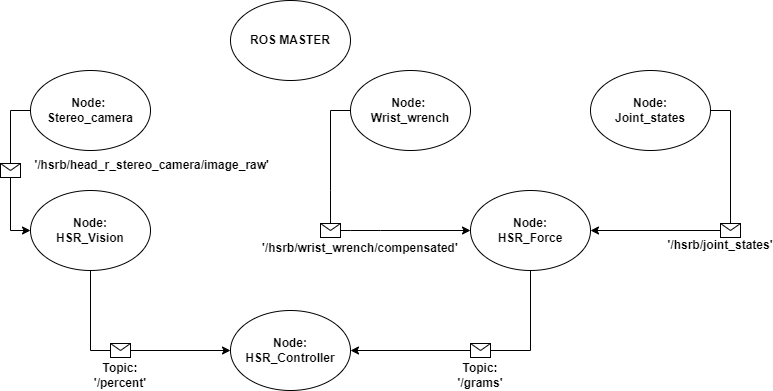

# ss22-pour-feedback

Workspace name: sdp_pouring_ws

Three packages:

1. hsr_vision
2. hsr_force
3. hsr_joint_controller

# ROS Architecture


# Sequence to execute commands

```
source sdp_pouring_ws/devel/setup.bash
```

<b>1.) Run the force_sensor.py file</b>

```
rosrun hsr_force force_sensor.py
```

<b>Action performed:</b>

a. This command will bring the Lucy to its initial pouring position. Make sure Lucy is far away from table to prevent collision.

b. Lucy will ask to place the container between the gripper. Grasp at a position between mid to top region of the container.

c. Weight of the grasped object would be announced as well as published (topic: \grams).

<b>2 a.) Run the edge detection file (If edge based detection algorithm(colour-independent) is to be performed)</b>

```
rosrun hsr_vision edge_detection.py
```

This will pop up the window of the current image. Draw bounding box around the cup by dragging the mouse around the cup (Eventhough the width of the glass is not entirely covered by the bounding box, make sure the entire height is covered for better accuracy). Press “r” to redraw the bounding box. Press “c” to confirm the bounding box and start publishing percentage.

!!! Make sure the glass position is not changed after the bounding box is set because the initial background image is subtracted for noise suppression.

Following pop up windows appear:

a. Cropped image of the selected region.

b. Sobel-y filter output subtracted with initial reference frame.

c. Thresholded and noise suppressed image.

d. A relative representation of the content within the glass.

<b>Action performed:</b>

a. Current liquid/cereal level in the cup is published (topic: \percent).

<b>2 b.) Run the colour detection file (If colour-mask based detection algorithm is to be performed)</b>
```
rosrun hsr_vision colour_detection.py
```

This will pop up the window of the current image. Draw bounding box around the cup by dragging the mouse around the cup (Eventhough the width of the glass is not entirely covered by the bounding box, make sure the entire height is covered for better accuracy). Press “r” to redraw the bounding box. Press “c” to confirm the bounding box and start publishing percentage.

Following pop up windows appear:

a. Track bar for selecting HSV parameters to detect appropriate color.

b. Real time view of the camera.

c. Mask would be displayed when lucy starts pouring liquid/cereal.

<b>Action performed:</b>

a. Current liquid/cereal level in the cup is published (topic: \percent).

<b>3.) Run the pouring_action.py file along with the target level</b>

```
rosrun hsr_joint_controller pouring_action.py --target user_input_level
```

This code controls the motion of wrist for pouring as well as desired level of liquid required in the cup. 

This subscribe to two topics:

a. \percent published by vision .

b. \grams published by force.

<b>Action performed:</b>

a. The forward movement and the task completion condition is being handled by vision feedback.

b. The intermediate stop and go-back-a-bit action when weight changes beyond a level is being handled by force feedback.
